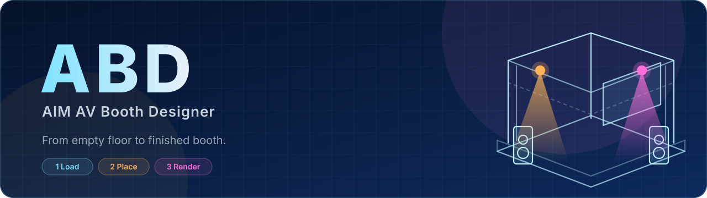
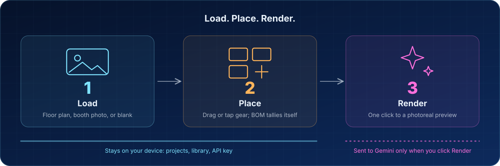

<div align="center">



<br>

**[Open the Designer →](https://johnlaz.github.io/abd/app/)** &nbsp;·&nbsp; **[Landing page](https://johnlaz.github.io/abd/)**

</div>

---

## What it is

ABD (AIM AV Booth Designer) turns a booth photo or floor plan and a few placed items into a photorealistic render your client can picture, before a single piece of gear ships. It's a local-first PWA: no account, no server, no install required.



- **Load** a floor plan or booth photo (or start on a blank canvas)
- **Place** gear from a library of 40+ items across 13 categories: drag on desktop, tap on phone or tablet, pinch to zoom
- **Render** it with AI: one click sends the layout to Gemini, which keeps every item exactly where you put it

## Features

| | |
|---|---|
| **Item Bank** | 40+ generic AV/event items (displays, kiosks, projection, audio, computers, furniture, lighting, truss, staging, networking, mobile, signage, accessories). Every item resizes freely. Upload your own PNGs too. |
| **Bill of Materials** | Auto-tallied from whatever's on the canvas |
| **AI Render** | Gemini image models, your own API key, optional per-project Render Notes |
| **Export** | Print-quality PNG with optional header, footer, watermark and numbered equipment legend |
| **Autosave** | Saved to IndexedDB as you work; reload and you're right where you left off |
| **Backup / Restore** | One JSON file with the whole local database |
| **Any screen** | Phone bottom-sheet panels, tap-to-add, pinch and pan, light/dark/system theme |
| **Offline** | Installable; the layout tool works with no connection (AI renders need one) |

## Live URLs

| | |
|---|---|
| Landing page | https://johnlaz.github.io/abd/ |
| App | https://johnlaz.github.io/abd/app/ |

## Repo layout

```
index.html              landing page (site homepage)
README.md
docs/
  banner.svg            README banner
  flow.svg              how-it-works diagram
app/
  index.html            the app: one HTML file (CSS + JS inline)
  manifest.json         PWA manifest (id, icons, screenshots)
  sw.js                 service worker (offline + update prompt)
  icon-192.png          install icon (maskable-safe)
  icon-512.png          install icon (maskable-safe)
  shot-1-load.png       install-UI / landing screenshots (1280x828)
  shot-2-place.png
  shot-3-render.png
  vendor/               pinned libraries, self-hosted so the app works offline from first load
    dexie.min.js        Dexie 4.0.8      (IndexedDB)
    konva.min.js        Konva 9.3.14     (canvas)
    html2canvas.min.js  html2canvas 1.4.1
```

No build step. Deploy the folder as-is to GitHub Pages or any static host. The landing page links to the app with `./app/`; the manifest and service worker use paths relative to `/app/`.

## AI / model setup

1. Get a Gemini API key at [aistudio.google.com](https://aistudio.google.com).
2. Open **Settings** in the app and paste the key (the field is masked; use **Show** to check it).
3. Pick a model. **Nano Banana 2** (`gemini-3.1-flash-image`) is the default.

**Refresh models.** When you paste a key, ABD asks Google which image-capable models that key can use and adds any new ones to the picker. You can also press **Refresh models from my key** any time. This only *adds* to the list: your existing models, default and saved selection are never replaced. If your saved model isn't in your key's current list it stays selected and gets a ⚠ flag, so you can decide.

**Billing note.** Image generation on the newer models appears to need a billing account linked to the Google Cloud project behind your key (pay-as-you-go, a few cents per image). A `429` on render is almost always this, not a bug. Check AI Studio billing or try another model.

**Render Notes** add per-project instructions on top of the automatic item legend, e.g. *"uplights should be blue"* or *"add a few people walking near the booth."*

## Keyboard shortcuts

| Key | Action |
|---|---|
| `Ctrl/Cmd + Z` | Undo |
| `Ctrl/Cmd + Shift + Z` or `Ctrl/Cmd + Y` | Redo |
| `Delete` / `Backspace` | Delete selected item |
| `[` / `]` | Rotate selected item −15° / +15° |
| `H` / `V` | Flip horizontally / vertically |

On touch screens, selecting an item shows a small action bar (rotate, flip, delete).

## Data & privacy

Projects, uploaded images, your library and your API key live in your browser's IndexedDB and `localStorage`. Nothing is sent anywhere except the flattened layout image and text prompt, sent **directly to Google's Gemini API** when you click **Render with AI**, with your own key. Use **Backup** for a portable copy you can **Restore** on any browser.

## Deploy / update

1. Commit the files above to the repo and enable GitHub Pages (branch root).
2. When you change anything the service worker caches, bump the version in **both** places so users get the update:
   - `APP_VERSION` in `app/index.html`
   - `CACHE_VERSION` in `app/sw.js` (`"abd-v" + APP_VERSION`)
3. Users on an older version see an **"A new version of ABD is ready · Reload"** banner. Nothing is swapped mid-layout.

If you move the app to a different path, update `id` and `start_url` in `app/manifest.json`.

## Known limitations

- AI renders are generative: treat them as presentation output, not the engineering source of truth. The vector layout and BOM stay accurate; a render can drift slightly run to run.
- Built-in icons are simple vector shapes (intentionally, so they resize cleanly to any footprint). Upload your own PNGs for anything that must look polished pre-render.
- One active project at a time (no project switcher yet).
- No true 3D: items are flat images composited in 2D; the AI step adds depth, shadows and materials.

## Changelog

### 2.0.0
- **New name and look:** ABD, with a cobalt/cyan blueprint theme taken from the new icon
- **Phone and tablet support:** responsive layout, bottom-sheet Item Bank and BOM, bottom dock, tap-to-add (drag-only placement didn't work on touch), pinch-zoom and pan, touch selection bar
- **Welcome screen** for an empty project
- **Model refresh** for Gemini (additive only), masked API key field
- **Offline hardening:** libraries self-hosted in `app/vendor/`, precached icons, in-app update prompt
- **Accessibility:** labels on icon-only controls, dialog semantics, focus trap and restore, visible focus rings
- **Fixes:** the "Drag items…" canvas hint was being wiped by the canvas library at startup (now a proper overlay); BOM category text was unreadable in light theme; landing page text touched the screen edge on phones
- **Version stamp** in the header and Settings

### 1.2
- Original release as "AIM AV — Booth Designer"

---

<div align="center">

© 2026 LAZLAB Creations. All Rights Reserved. · [lazlab.io@gmail.com](mailto:lazlab.io@gmail.com)

</div>
